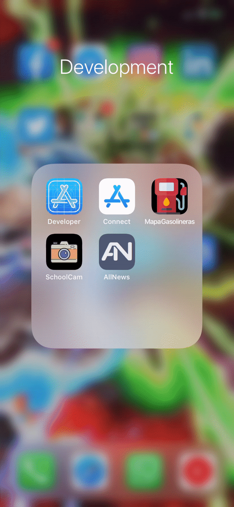

# AllNews

Aplicación de feed de noticias de actualidad de diversas fuentes e idiomas. Implementa el API NewsAPI. El objetivo con este proyecto es aprender a manejar peticiones asíncronas (GCD) a un RestAPI, CoreData, modo obscuro y localización (inglés y español).

## Tecnologías utilizadas

* UIKit
* CoreData
* URLSession
* Grand Central Dispatch
